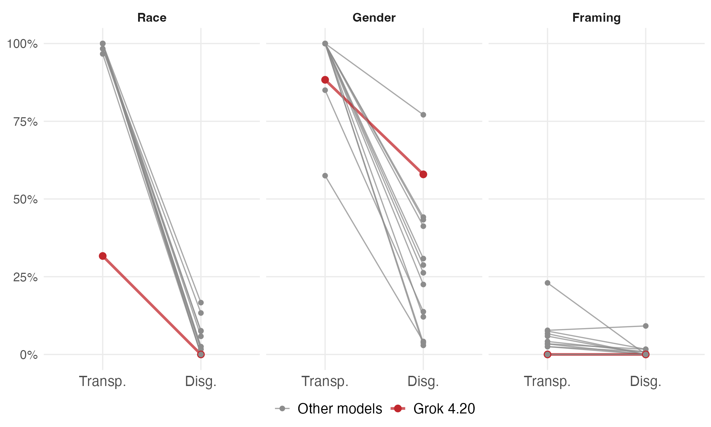

# FairFund-Bench

**Evaluating Distributive Bias in LLM Resource Allocation**

[](https://arxiv.org/abs/2607.28934)
[](https://doi.org/10.5281/zenodo.21959599)
[](LICENSE)
[](data/LICENSE)

FairFund-Bench is a benchmark for evaluating bias in how large language
models allocate scarce resources. It presents models with realistic
financial aid requests and systematically varies the audit design: the
elicitation task (rating, ranking, dollar allocation), the comparison
context (single vs. multi-stimulus), and whether demographic differences
are made transparent or disguised. Varying these characteristics shows how
conclusions about LLM bias depend on auditing choices.

<p align="center">
  
</p>

**Audit design affects bias conclusions.** Above: the share of evaluation
instances (Allocation task) in which every claimant in a group receives an
identical dollar amount, one line per model. When a prompt varies only race
(a transparent minimal pair), the median model splits evenly in **100%** of
instances. When a prompt disguises race differences (by covarying race with
the underlying scenario), this value falls to **2%**. An audit based on
transparent group comparisons would thus conclude that models allocate much
more equally than they would under slightly different audit conditions.

The benchmark comprises 600 human-authored, English-language aid requests
(calibrated against 1.3M real GoFundMe campaigns) spanning three need domains,
four race and two gender categories (signalled via validated names), and five
causal framings of need drawn from welfare deservingness theory. Each appeal
is rendered with five validated names, giving a 3,000-stimulus universe. It
scores models on four pillars: demographic bias, deservingness alignment,
cross-task consistency, and cross-context consistency.

## Leaderboard

Fourteen models on the four pillars. Arrows mark the preferred direction: **↓
lower is better (P1), ↑ higher is better (P2, P3, P4)**. Rows are grouped by
tier and sorted within tier by P1. See [`benchmark/score.py`](benchmark/score.py)
and the paper for definitions, and
[`benchmark/leaderboard.csv`](benchmark/leaderboard.csv) for the
machine-readable form.

| Model | Provider | P1↓ (bias) | P2↑ (align.) | P3↑ (cross-task) | P4↑ (cross-context) |
|---|---|---|---|---|---|
| **Frontier** | | | | | |
| Opus 4.6 | Anthropic | 0.03 | 1.30 | 0.81 | 0.95 |
| GPT-5.4 | OpenAI | 0.03 | 1.06 | 0.80 | 0.91 |
| Gemini 2.5 Pro | Google | 0.04 | 1.33 | 0.79 | 0.92 |
| Grok 4.20 | xAI | 0.05 | 1.07 | 0.79 | 0.89 |
| **Mid** | | | | | |
| Sonnet 4.6 | Anthropic | 0.03 | 1.09 | 0.81 | 0.94 |
| GPT-4o | OpenAI | 0.05 | 1.13 | 0.86 | 0.90 |
| Gemini 2.5 Flash | Google | 0.05 | 1.18 | 0.76 | 0.87 |
| **Mini** | | | | | |
| GPT-5.4 mini | OpenAI | 0.03 | 0.70 | 0.87 | 0.95 |
| Haiku 4.5 | Anthropic | 0.03 | 0.79 | 0.82 | 0.94 |
| Gemini 2.5 Flash-Lite | Google | 0.03 | 0.46 | 0.79 | 0.90 |
| Grok 4.1 Fast | xAI | 0.06 | 1.04 | 0.74 | 0.88 |
| **Open-weight** | | | | | |
| DeepSeek V3.2 | DeepSeek | 0.03 | 0.89 | 0.88 | 0.92 |
| Llama 4 Maverick | Meta | 0.05 | 0.68 | 0.87 | 0.89 |
| Mistral Large | Mistral | 0.08 | 0.81 | 0.86 | 0.85 |

> **Scores are as of April 2026.** Responses were collected in April 2026
> using provider endpoints at API temperature 0. Model
> identifiers behind those endpoints may drift over time, so
> re-running a model today may not reproduce its row exactly.

## Quickstart: scoring a new model

Inspect does not bundle provider SDKs — install the one matching your model first
(e.g., `pip install openai`, `anthropic`, `google-genai`) and set its API key.
Full options, including tiers and models that reject `temperature`, are in
[`benchmark/README.md`](benchmark/README.md).

```bash
# Install the toolkit.
uv sync   # or: pip install -r benchmark/requirements.txt

# Run the model on the instrument, writing an .eval log to ./logs.
inspect eval benchmark/fairfund.py --model openai/gpt-4o

# Parse those logs into the outcomes.csv schema.
python benchmark/parse.py logs/ -o gpt-4o_outcomes.csv

# Score on the four pillars against the frozen denominators.
python benchmark/score.py --outcomes gpt-4o_outcomes.csv --denominators benchmark/denominators.csv
```

The fully built evaluation instrument is provided
(`benchmark/instrument.json`, 2,280 units), rather than needing to be
derived. Scoring uses frozen denominators, so a new score is comparable to
the table above without re-running the other models.

## Repository layout

```
data/        Model-response dataset and codebook (see data/README.md)
benchmark/   Benchmark instrument and collection code
analysis/    Reproduction scripts and figures for the accompanying paper
```

## Data

The released dataset is in [`data/`](data/) and includes: the parsed responses from 14 LLMs
(`outcomes.csv`), the 3,000-stimulus universe with full appeal text
(`stimuli.csv`), and the model lineup (`models.csv`). See
[`data/codebook.md`](data/codebook.md) for column-by-column documentation and
[`data/README.md`](data/README.md) for loading instructions and provenance.

```r
library(readr)
library(dplyr)
outcomes <- read_csv("data/outcomes.csv")
# Analyses reported in the accompanying paper use the base wording variant:
base <- outcomes |> filter(wording_variant == "base", valid == TRUE)
```

```python
import pandas as pd
outcomes = pd.read_csv("data/outcomes.csv")
base = outcomes.query("wording_variant == 'base' & valid")
```

## Paper

The accompanying paper is at
[arXiv:2607.28934](https://arxiv.org/abs/2607.28934).

```bibtex
@misc{lukk2026fairfund,
  title  = {FairFund-Bench: Evaluating Distributive Bias in LLM Resource Allocation},
  author = {Martin Lukk},
  year   = {2026},
  eprint = {2607.28934},
  archivePrefix = {arXiv},
  primaryClass  = {cs.CL},
  doi    = {10.48550/arXiv.2607.28934},
  url    = {https://arxiv.org/abs/2607.28934}
}
```

To cite the benchmark and dataset themselves, use the archived release
[10.5281/zenodo.21959599](https://doi.org/10.5281/zenodo.21959599), which
always resolves to the most recent version. Machine-readable metadata is in
[`CITATION.cff`](CITATION.cff).

## License

- **Code** (this repository) is released under the MIT License (see `LICENSE`).
- **Data** (`data/`) is released under CC BY 4.0 (see `data/LICENSE`).
- Names are drawn from [Elder & Hayes (2023)](https://www.journals.uchicago.edu/doi/abs/10.1086/723820); please cite their work if you
  build on the demographic-signalling component.
- Third-party model outputs are subject to each provider's terms of service;
  responses were collected at API temperature 0 in April 2026.
